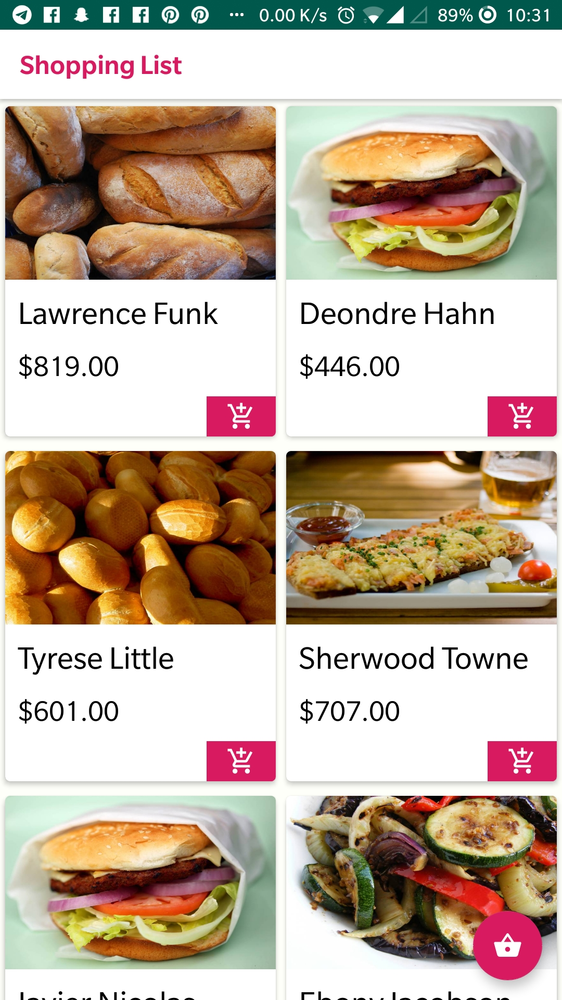

## Shopping cart with Kotlin.

A shopping cart with Kotlin

## Getting Started
Make sure you have Android Studio on your machine

1.  Clone this repository and cd into it
2.  Run the project with Android Studio
3.  See the [tutorial](https://pusher.com/tutorials/live-map-lealfet-vue-adonis) for useful notes 

### Prerequisites

* Java/JDK
* Android Studio

## Built With

* [Kotlin](https://kotlinlang.org/) - Kotlin language
* [Android Studio](https://developer.android.com/studio/) - Android Studio

